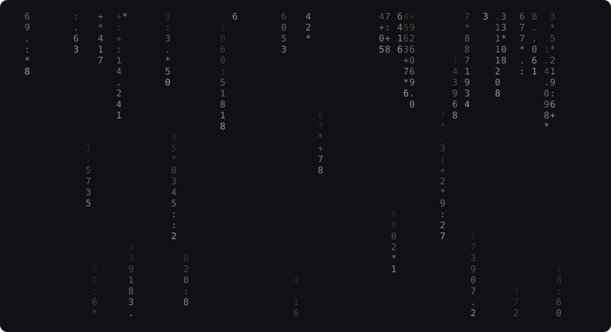
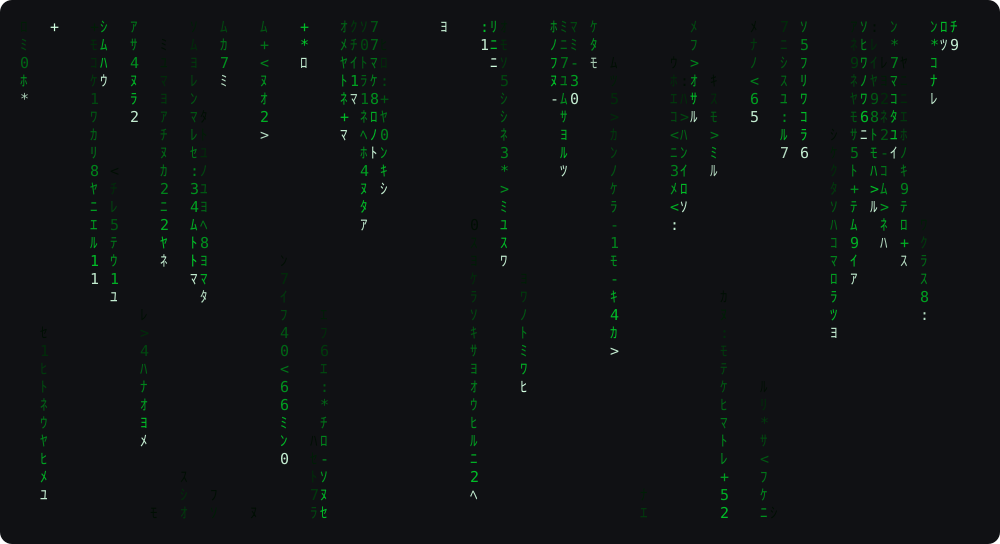

# Stillterm

Quiet character animation for your terminal and macOS screensaver, powered by Rust.

Sparse streams, fading trails, and a small reusable animation engine. Stillterm
runs directly in your terminal, with deterministic seeds and a 30 FPS default.
It has no background service or browser runtime.



*Engine snapshot: seed 42, four seconds, 96×28 cells. Font and brightness vary by
terminal. An animation recording is planned for the first release.*

**Status:** Terminal application plus macOS and Windows screensaver development
builds. Linux native integration is planned. Paid signing and public binary releases
are deferred while development continues. Stillterm does not lock your session.

## Install

Requires [Rust](https://www.rust-lang.org/tools/install) 1.88 or newer and a system
linker. With rustup, this checkout selects the tested Rust 1.88.0 toolchain.

```sh
git clone https://github.com/saeedet/Stillterm.git
cd Stillterm
cargo install --path crates/terminal --locked
```

This installs `stillterm` into Cargo's binary directory. Ensure that directory is
on your `PATH`. Uninstall with `cargo uninstall stillterm`.

Signed prebuilt downloads are not available yet. There is no
published crates.io package at this stage; use the source installation above.

## macOS screensaver

On macOS, build a universal native screensaver and try it in a window:

```sh
rustup target add aarch64-apple-darwin x86_64-apple-darwin
scripts/build-macos.sh
scripts/check-macos.sh --preview
```

Open `target/macos/Stillterm.saver` to install. It includes both themes and a native
options panel. Local installed-screensaver testing passed on Apple M3 with macOS
14.6.1, including theme switching, multiple displays, sleep/wake, and cleanup after
dismissal. Build 5 passes a retained-view memory regression check; after three
installed previews, the idle helper measured 117 MiB and 0% CPU. Longer-session
memory and active-rendering performance validation are still pending. Signed,
notarized downloads and broader compatibility testing are also pending. See [macOS setup and distribution](docs/macos.md).

## Windows screensaver

On Windows, run `./scripts/build-windows.ps1` from PowerShell to build
`target/windows/Stillterm.scr`. It supports full screen, native settings, and the
embedded Windows preview. The manual checklist passed on Windows 10 and Windows 11.
Milestone 3 implementation and manual testing are complete. This remains an unsigned
development build. See [setup and the test checklist](docs/windows.md).

## Run

```sh
stillterm
stillterm run --fps 30 --seed 42
stillterm --speed 0.6 --density 0.12
stillterm --config examples/config.toml
stillterm list
```

Press **q**, **Escape**, or **Ctrl+C** to quit. Resize the terminal while it runs.
For development without installation, use `cargo run --release -- --seed 42`.
Use an ANSI-capable terminal; Windows Terminal is the intended Windows surface.

## Matrix theme

```sh
stillterm --theme matrix
stillterm --config examples/matrix.toml
```

Green trails, pale heads, and half-width Katakana mixed with digits and symbols.
The preset uses speed `1.6`, density `0.35`, and intensity `1.0`; explicit file or
CLI settings override those defaults. The original look remains the default and
is available as `--theme monochrome`.



*Engine snapshot using the theme's ideal colors; terminal palettes and fonts vary.*

Use a font with half-width Katakana support. For an ASCII fallback, add
`--characters '0123456789:<>*+-'`. Standard terminal glyphs cannot reproduce the
movie's mirrored characters. True-color terminals show the smoothest green ramp;
256-color and basic-color terminals use reduced palettes. `NO_COLOR` disables color.

## Configure

Settings apply in this order: built-in defaults, an explicitly supplied TOML file,
then command-line overrides. The selected theme supplies defaults for omitted
visual settings. No configuration file is written automatically.

| Setting | Default | Accepted values |
| --- | --- | --- |
| `effect` | `"rain"` | `rain` |
| `theme` | `"monochrome"` | `monochrome`, `matrix` |
| `fps` | `30` | Integer, 10–60 |
| `speed` | `1.0` | 0.1–4.0 |
| `density` | `0.18` | 0.0–1.0; stream activation probability |
| `intensity` | `0.7` | 0.0–1.0 |
| `characters` | `"0123456789.:+*"` | 1–256 printable, single-column characters |
| `seed` | `42` | Unsigned 64-bit integer |

See [the example configuration](examples/config.toml) or `stillterm --help`.
The numeric and character defaults in the table describe the monochrome theme.
ASCII is the most portable character set. Wide, combining, control, and
ambiguous-width characters are rejected. Nonempty `NO_COLOR` disables color;
the monochrome theme otherwise uses a detected grayscale or basic-color palette.

## Platforms

| Surface | Status |
| --- | --- |
| macOS terminal | Tested locally on Apple Silicon, including PTY lifecycle checks |
| Windows terminal | Cross-checked for compilation; native CI configured; interactive testing pending |
| Linux terminal | Cross-checked for compilation; native CI and PTY checks configured |
| macOS `.saver` | Installed screensaver tested on Apple M3 / macOS 14.6.1; Intel slice checked under Rosetta; signed downloads pending |
| Windows `.scr` | Manual checklist passed on Windows 10 and Windows 11; unsigned x64 build |
| Omarchy / Hyprland idle integration | Planned — Milestone 4; version-specific integration |

[CI](https://github.com/saeedet/Stillterm/actions) checks the workspace and macOS
bundle. The terminal executable does not provide native screensaver integration.
See [platform research and acceptance checks](docs/platform-support.md).

## How it works

`stillterm-engine` owns a character grid, seeded rain state, and fixed simulation
steps. `stillterm` owns the terminal, configuration loading, timing, and input.
The renderer compares presented cells and writes changed runs. The engine has no
OS or graphical-framework dependencies. Engine and CLI crates forbid unsafe Rust;
the macOS bridge isolates the documented C interface.

On the initial Apple M3 benchmark, the CLI used less than 1% of one CPU core at
30 FPS in a drained pseudo-terminal. This excludes terminal-emulator rendering;
see [measurements and reproduction steps](docs/performance.md).

For the boundaries and determinism contract, read [architecture](docs/architecture.md).
To extend the engine, read [adding an effect](docs/adding-an-effect.md).

## Contribute

```sh
cargo test --workspace --all-targets --locked
cargo fmt --all --check
cargo clippy --workspace --all-targets --locked -- -D warnings
```

[Contributing](CONTRIBUTING.md) covers terminal tests, visual changes, and bug reports.
Licensed under [MIT](LICENSE).
